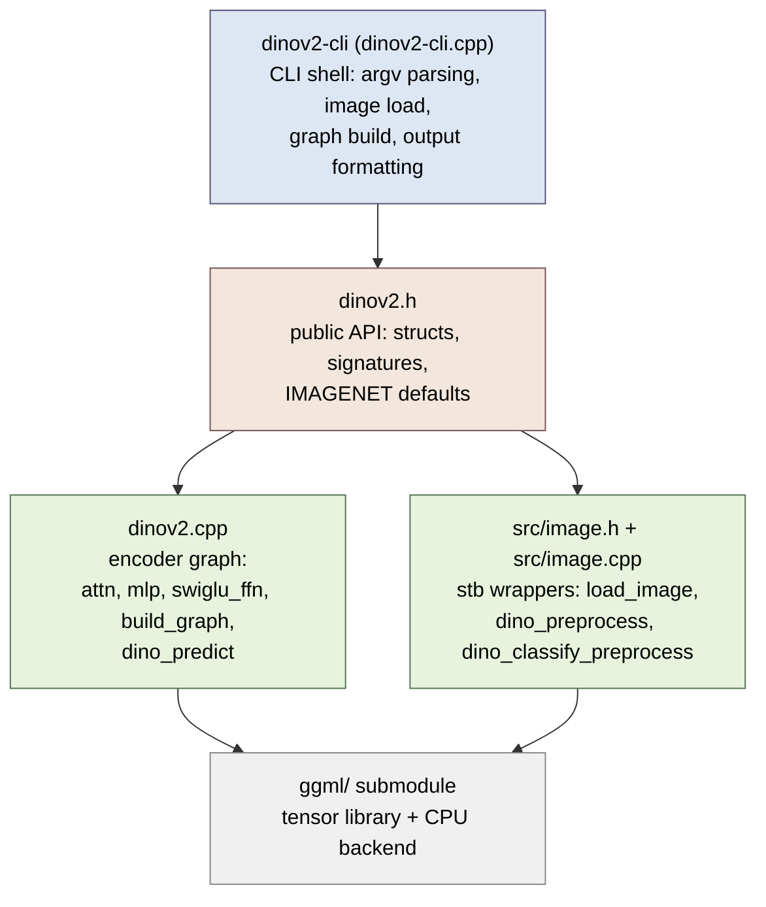
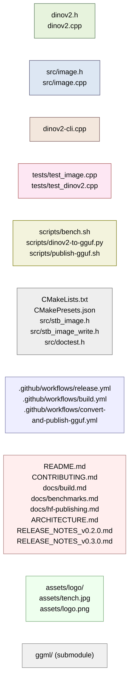
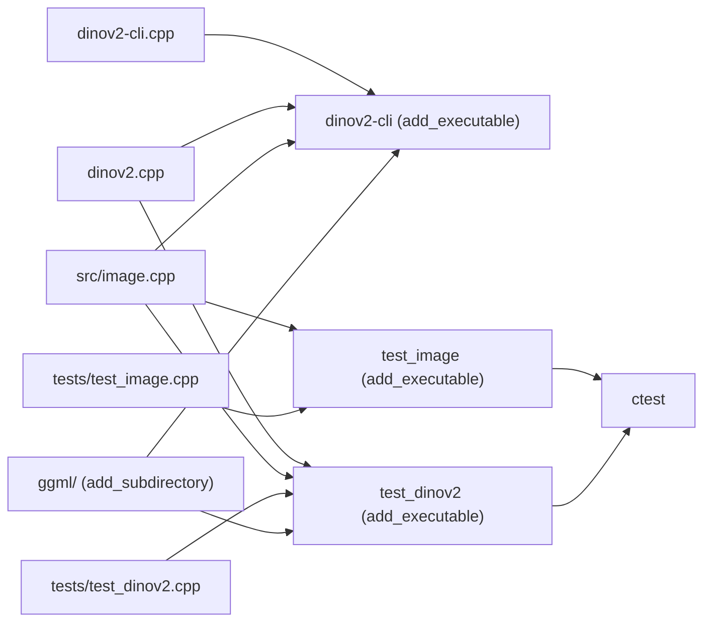
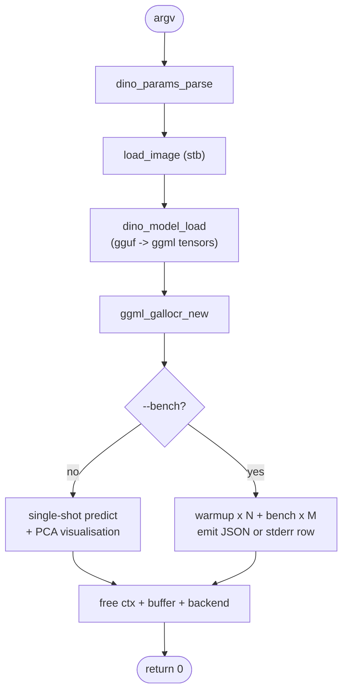

# Architecture

## Goals

`dinov2.cpp` is a from-scratch C++ port of Meta's DINOv2 vision encoder that runs on
the [ggml](https://github.com/ggml-org/ggml) tensor library. It is **one CLI binary**
(`dinov2-cli`) that loads any ggml-supported GGUF weight, decodes an image with
vendored `stb_image`, runs the encoder graph, and prints either classification
predictions or PCA-visualised patch features. It is **not** a Python wrapper, a
training framework, a model converter, or a multi-backend serving system: those
concerns live in adjacent repos (`dinov2-cpp-core` for GGUF conversion and HF
distribution, `ggml` for backends).

## Layer model

The dependency rule: source code dependencies point strictly **downward**. The
CLI shell only includes the public header; the implementation includes ggml;
ggml is a vendored submodule that includes nothing of ours.



Arrows never point upward. `dinov2-cli.cpp` does not include `ggml.h` directly;
it talks to ggml only through the opaque struct types in `dinov2.h`.

## File-by-file index (role groups)



Abridged table:

| Path | Role | One-line purpose |
|:-----|:-----|:-----------------|
| `dinov2.h`, `dinov2.cpp` | Core | Public API + encoder graph. |
| `src/image.{h,cpp}` | Library | stb-backed image load + `dino_preprocess`. |
| `dinov2-cli.cpp` | CLI | `main`: arg parsing + bench loop. |
| `tests/test_{image,dinov2}.cpp` | Test | doctest pure-function coverage. |
| `scripts/{bench.sh,dinov2-to-gguf.py,publish-gguf.sh}` | Tool | Bench sweep + PyTorch→GGUF + HF upload. |
| `CMakeLists.txt`, `CMakePresets.json`, vendored stb/doctest | Build | CMake build + vendored single-file deps. |
| `.github/workflows/*` | CI | 3 workflows: release, build, convert-and-publish. |
| `README.md`, `CONTRIBUTING.md`, `docs/*`, `ARCHITECTURE.md`, `RELEASE_NOTES_*.md` | Doc | User + contributor-facing docs. |
| `assets/*` | Asset | Logo + default input image. |
| `ggml/` | Submodule | Vendored ggml at pinned SHA. |

## Build targets



`test_image` and `test_dinov2` register themselves with `add_test(NAME …)`;
`ctest --test-dir build` runs both. `dinov2-cli` is not a test (it needs a
real GGUF + image that the test environment does not guarantee).

## CLI surface

`dinov2-cli --help`:

```text
usage: ./bin/dinov2-cli [options]

options:
  -h, --help              show this help message and exit
  -m FNAME, --model       model path (default: ../ggml-model-f16.gguf)
  -i FNAME, --inp         input file (default: ../assets/tench.jpg)
  -o FNAME, --out         output file for backbone PCA features (default: pca_visual.jpg)
  -k N, --topk            top k classes to print (default: 5)
  -t N, --threads         number of threads to use during computation (default: 4)
  -c, --classify          classify the image or get backbone PCA features (default: 0)
  -fa, --flash_attn       enable flash_attn, less accurate (default: 0)

Benchmark:
  --bench                 enable bench loop (default repeats=5, warmup=1); skips PCA output
  --bench-runs N          number of timed runs (overrides default 5 when --bench is set)
  --bench-warmup N        number of warmup runs discarded before timing (default: 1)
  --bench-json            emit one JSON object per line to stdout instead of a row
```

Flow:



Every flag maps to one `dino_params` field (`dinov2.h:57-72`). `--bench-json`
is the only stable machine-readable output; `scripts/bench.sh` parses it line
by line.

## Public API surface

Verbatim from `dinov2.h` (the entire 112-line public surface):

```c++
struct ImgSize { int width = 0; int height = 0; };

constexpr float IMAGENET_DEFAULT_MEAN[3] = {0.485f, 0.456f, 0.406f};
constexpr float IMAGENET_DEFAULT_STD[3]  = {0.229f, 0.224f, 0.225f};

uint32_t get_val_u32(const struct gguf_context *ctx, const char *key);
const char *get_val_str(const struct gguf_context *ctx, const char *key);

struct dino_hparams {
    uint32_t hidden_size, num_hidden_layers, num_attention_heads;
    uint32_t num_classes, num_register_tokens, patch_size, img_size;
    uint32_t ftype; float eps; std::string interpolation;
    std::map<int, std::string> id2label;
    uint32_t n_enc_head_dim() const, n_img_size() const,
              n_patch_size() const, n_img_embd() const;
};

struct dino_model {
    dino_hparams hparams;
    struct ggml_context *ctx;
    ggml_backend_t backend = nullptr;
    ggml_backend_buffer_t buffer;
    std::map<std::string, struct ggml_tensor *> tensors;
};

struct dino_params {
    uint32_t seed = 42, topk = 5;
    bool enable_flash_attn = false;
    uint32_t n_threads = std::min(4u, std::thread::hardware_concurrency());
    bool classify = false;
    std::string model = "../ggml-model-f16.gguf";
    std::string fname_inp = "../assets/tench.jpg";
    std::string image_out = "pca_visual.jpg";
    float eps = 1e-6f;
    uint32_t bench_repeats = 0;     // --bench default: 5
    uint32_t bench_warmup = 1;
    bool bench_json = false;
};

// encoder graph
struct ggml_tensor *attn(...), *mlp(...), *swiglu_ffn(...);
void forward_features(...), forward_head(...);

struct dino_output {
    std::optional<std::vector<uint32_t>> preds;
    std::optional<std::vector<float>> patch_tokens;
};

void print_t_f32(const char *title, const struct ggml_tensor *t, int n);

ImageF dino_classify_preprocess(const Image &img, const dino_hparams &params);
ImageF dino_preprocess(const Image &img, const dino_hparams &params);

bool dino_model_load(ImgSize img_size, const std::string &fname,
                     dino_model &model, const dino_params &params);

std::vector<float> interpolate_pos_embed(ImgSize img_size,
                                         const float *pos_embed_data,
                                         const dino_hparams &hparams);

struct ggml_cgraph *build_graph(ImgSize img_size, struct ggml_context *ctx_cgraph,
                                const dino_model &model, const dino_params &params);

std::unique_ptr<dino_output> dino_predict(const dino_model &model, const ImageF &img,
                                          const dino_params &params, ggml_gallocr_t allocr);

void print_usage(int argc, char **argv, const dino_params &params);
bool dino_params_parse(int argc, char **argv, dino_params &params);
```

`dinov2.h` includes `ggml.h` and `src/image.h` so callers transitively pick up
ggml's types and `Image` / `ImageF`. There are no `extern "C"` exports — this
is C++, consumed by the CLI shell in the same translation-unit set.

## What ships per release

Each `v*` tag triggers `.github/workflows/release.yml`, which builds **one
binary per platform** (the `quantize` binary that existed through v0.2.0 is
gone as of v0.3.0):

| Platform    | Asset                                     |
|:------------|:------------------------------------------|
| macOS arm64 | `dinov2-v0.3.0-bin-macos-arm64.tar.gz`    |
| Linux x64   | `dinov2-v0.3.0-bin-ubuntu-x64.tar.gz`     |
| Linux arm64 | `dinov2-v0.3.0-bin-ubuntu-arm64.tar.gz`   |
| Windows x64 | `dinov2-bin-win-cpu-x64.zip` (contains `.exe`) |

The `release` aggregation job downloads all four artifacts, runs `sha256sum`
on each, and attaches `SHA256SUMS.txt` plus the per-platform archives to the
GitHub Release.

## What doesn't ship

Deliberately untracked by `.gitignore` and not in release archives:

- `build/`, `build-*/`, `cmake-build-debug/` — local CMake output.
- `.venv/`, `.venv-publish/` — per-run converter venv (created by `publish-gguf.sh`).
- `*.gguf`, `/models`, `/data` — pre-converted weights live on HF; users pull
  them with `huggingface-cli download`.
- `.agents/` — agent working notes (memory + plans); force-added per global
  AGENTS.md policy but not in release tarballs.
- `.publish-logs/` — per-run audit trail from `publish-gguf.sh`.
- `.DS_Store`, `.env` — OS + local secrets.

## Where to read next

- [CONTRIBUTING.md](CONTRIBUTING.md): dev harness, CMake presets, sanitizer
  builds, clang-format gate, PR guidelines.
- [docs/build.md](docs/build.md): per-device optimisations, OpenMP, sanitizer
  presets.
- [docs/benchmarks.md](docs/benchmarks.md): how to read the tables,
  methodology, reproducing locally.
- [docs/hf-publishing.md](docs/hf-publishing.md): `HF_TOKEN` setup, the
  `convert-and-publish-gguf` workflow, the 8 published HF repos.
- [README.md](README.md): quickstart, downloads, why this fork exists.
- [RELEASE_NOTES_v0.3.0.md](RELEASE_NOTES_v0.3.0.md): breaking changes
  (`inference` → `dinov2-cli`, `quantize` removed), upgrade notes.
