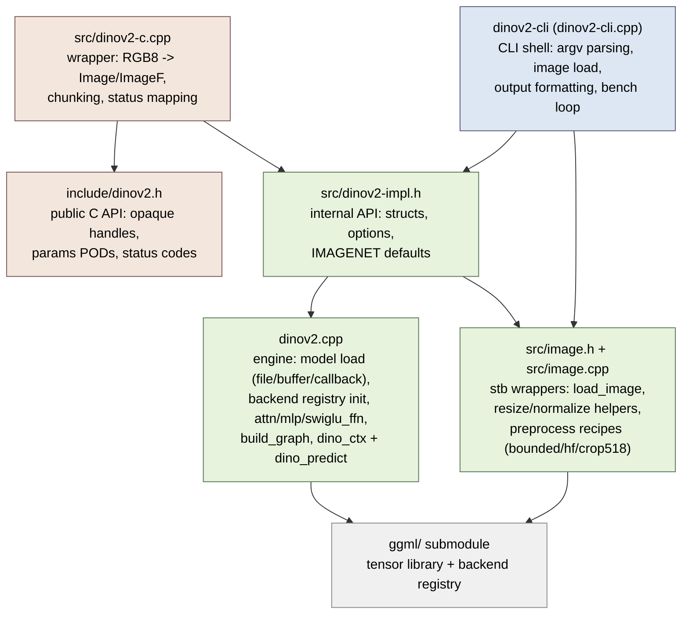
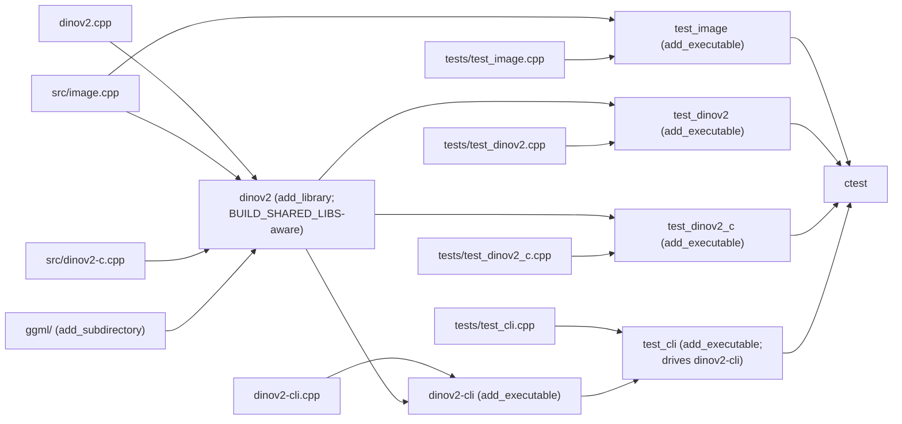
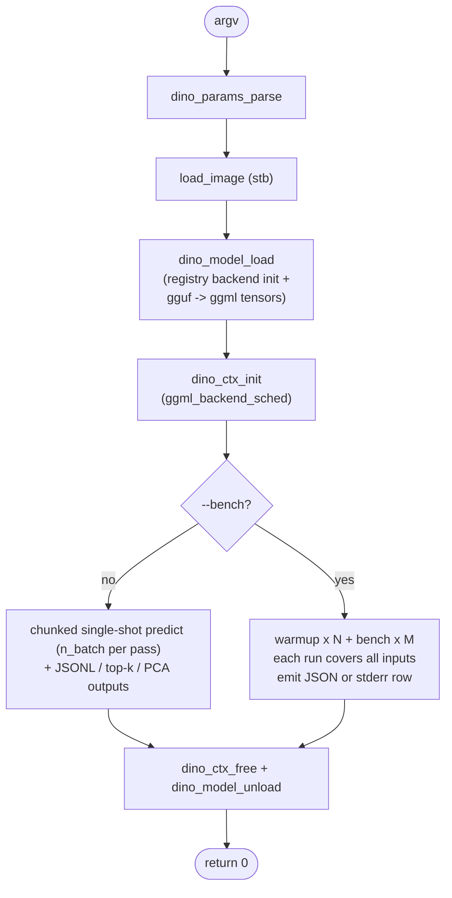

# Architecture

## Goals

`dinov2.cpp` is a from-scratch C++ port of Meta's DINOv2 vision encoder that runs on
the [ggml](https://github.com/ggml-org/ggml) tensor library. It ships **one CLI binary**
(`dinov2-cli`) plus a reusable **library** (`libdinov2`) that loads any
ggml-supported GGUF weight, decodes an image with vendored `stb_image`, runs
the encoder graph, and prints classification predictions, embeddings JSON, or
PCA-visualised patch features. The library exposes a pure C API
(`include/dinov2.h`) for external consumers. It is **not** a Python wrapper, a
training framework, a model converter, or a multi-backend serving system: those
concerns live in adjacent repos (`dinov2-cpp-core` for GGUF conversion and HF
distribution, `ggml` for backends).

## Layer model

The dependency rule: source code dependencies point strictly **downward**. The
CLI shell and the C API wrapper both sit on top of the engine; the
implementation includes ggml; ggml is a vendored submodule that includes
nothing of ours. Engine files never include the public C header: only
`src/dinov2-c.cpp` sees both worlds.



Arrows never point upward. `dinov2-cli.cpp` includes `ggml.h` only for timing
and scheduler synchronisation; all tensor plumbing lives behind
`src/dinov2-impl.h`. The internal C++ header is not installed; only `include/`
is on the library's public include path, so a bare `#include "dinov2.h"`
always resolves to the stable C API for embedders.

**Tier-2 surfaces** (`tools/server/`, `wasm/`, `examples/`) sit above this
graph: they may consume the public C header and in-repo internal headers
(`src/image.h`), but nothing tier-1 includes, links, or shells out to them.
They are off-by-default (`DINOV2_BUILD_WASM`, `DINOV2_BUILD_SERVER`) or not
part of the build at all, and their CI jobs are advisory only. See
[docs/tiers.md](docs/tiers.md).

## File-by-file index (role groups)

```mermaid
graph LR
    classDef core  fill:#e7f3dd,stroke:#575,color:#000;
    classDef lib   fill:#dde7f3,stroke:#557,color:#000;
    classDef cli   fill:#f3e7dd,stroke:#755,color:#000;
    classDef test  fill:#fde7f3,stroke:#a55,color:#000;
    classDef tool  fill:#f3f3dd,stroke:#770,color:#000;
    classDef build fill:#eee,stroke:#777,color:#000;
    classDef ci    fill:#eef,stroke:#77a,color:#000;
    classDef doc   fill:#fee,stroke:#a77,color:#000;
    classDef asset fill:#efe,stroke:#7a7,color:#000;
    classDef sub   fill:#f0f0f0,stroke:#888,color:#000;

    Core["src/dinov2-impl.h<br/>dinov2.cpp<br/>include/dinov2.h<br/>src/dinov2-c.cpp"]
    Lib["src/image.h<br/>src/image.cpp"]
    CLI["dinov2-cli.cpp"]
    Test["tests/test_image.cpp<br/>tests/test_dinov2.cpp<br/>tests/test_dinov2_c.cpp<br/>tests/test_cli.cpp"]
    Tool["scripts/bench.sh<br/>scripts/dinov2-to-gguf.py<br/>scripts/publish-gguf.sh"]
    Build["CMakeLists.txt<br/>CMakePresets.json<br/>src/stb_image.h<br/>src/stb_image_write.h<br/>src/doctest.h"]
    Tier2["wasm/ (embind shim + demo)<br/>tools/server/ (dinov2-server)<br/>examples/ (dedup, ci-visual-regression)"]
    CI[".github/workflows/release.yml<br/>.github/workflows/build.yml<br/>.github/workflows/extras.yml<br/>.github/workflows/convert-and-publish-gguf.yml"]
    Doc["README.md<br/>CONTRIBUTING.md<br/>docs/cli.md<br/>docs/build.md<br/>docs/benchmarks.md<br/>docs/hf-publishing.md<br/>docs/stability.md + docs/tiers.md<br/>docs/wasm.md<br/>ARCHITECTURE.md<br/>CHANGELOG.md"]
    Asset["assets/logo/<br/>assets/tench.jpg<br/>assets/logo.png"]
    Sub["ggml/ (submodule)"]

    class Core core
    class Lib lib
    class CLI cli
    class Test test
    class Tool tool
    class Tier2 tool
    class Build build
    class CI ci
    class Doc doc
    class Asset asset
    class Sub sub
```



Abridged table:

| Path | Role | One-line purpose |
|:-----|:-----|:-----------------|
| `include/dinov2.h` | Core | Public C API (opaque handles, status codes); the installed header. |
| `src/dinov2-c.cpp` | Core | C API wrapper: param conversion, RGB8 packing, chunking, status mapping. |
| `src/dinov2-impl.h`, `dinov2.cpp` | Core | Internal C++ API + encoder graph + model load + inference. |
| `src/image.{h,cpp}` | Library | stb-backed image load + `dino_preprocess_padded` / feature-mode `--preprocess` recipes (bounded 518 bound, hf, crop518). |
| `dinov2-cli.cpp` | CLI | `main`: arg parsing + bench loop. |
| `tests/test_{image,dinov2,dinov2_c,cli}.cpp` | Test | doctest coverage + CLI black-box cases. |
| `scripts/{bench.sh,dinov2-to-gguf.py,publish-gguf.sh}` | Tool | Bench sweep + PyTorch→GGUF + HF upload. |
| `CMakeLists.txt`, `CMakePresets.json`, vendored stb/doctest | Build | CMake build + vendored single-file deps. |
| `wasm/` | Tier-2 | Emscripten embind shim over the C API + browser demo (`DINOV2_BUILD_WASM`). |
| `tools/server/` | Tier-2 | `dinov2-server` HTTP embeddings service over the C API + vendored cpp-httplib (`DINOV2_BUILD_SERVER`). |
| `examples/` | Tier-2 | Copy-paste examples: `dedup/` (near-duplicate finder), `ci-visual-regression/` (GitHub Action). |
| `.github/workflows/*` | CI | build, release, convert-and-publish, parity, bench, changelog, extras (tier-2 advisory jobs). |
| `README.md`, `CONTRIBUTING.md`, `docs/*`, `ARCHITECTURE.md`, `RELEASE_NOTES_*.md` | Doc | User + contributor-facing docs. |
| `assets/*` | Asset | Logo + default input image. |
| `ggml/` | Submodule | Vendored ggml at pinned SHA. |

## Build targets



`test_image`, `test_dinov2`, `test_dinov2_c`, and `test_cli` register
themselves with `add_test(NAME …)`; `ctest --test-dir build` runs all four.
`test_cli` spawns the built `dinov2-cli` binary with argument fixtures;
`test_dinov2_c` exercises the public C API on synthetic GGUFs.
`dinov2-cli` itself is not a test (a real GGUF + image are only guaranteed
when `models/` is populated).

Two optional executables exist only when their tier-2 options are ON:
`dinov2-wasm` (`DINOV2_BUILD_WASM`, Emscripten toolchain) and
`dinov2-server` (`DINOV2_BUILD_SERVER`, vendored cpp-httplib). Neither is in
the default `all` graph unless requested.

## CLI surface

`dinov2-cli --help`:

```text
usage: ./bin/dinov2-cli [options]

Model:
  -m FNAME, --model     model path (default: ../model.gguf)
  -fa, --flash_attn     enable flash attention, less accurate (default: off)
  -t N, --threads       number of threads to use during computation, 1 or greater (default: 4)

Input:
  -i FNAME, --inp       input image file; repeat or comma-separate for several
                        (default: ../assets/tench.jpg)
  -s N, --seed          accepted for compatibility; has no effect (default: 42)
  --batch N             max images per forward pass; inputs run in chunks of N
                        (default: 1, max: 64)

Preprocessing (feature mode only; rejected with -c):
  --preprocess MODE     bounded (default): resize shortest edge to 518 when larger;
                        hf: shortest edge 256 + center crop 224 (HF recipe);
                        crop518: shortest edge 518 + center crop 518 (fixed 37x37 grid)
  --no-resize           bounded mode: keep native resolution (still capped)
  --max-tokens N        hard cap on patch tokens per image, 0 disables
                        (default: 4 * (518/patch)^2 from the model's patch size)

Output modes:
  -c, --classify        classify each input image and print top-k labels (default: off)
  -k N, --topk          top k classes to print, 1 through model class count (default: 5)
  --print-embeddings    emit embeddings JSON on stdout, one object per input image (JSONL)
  --embeddings-binary   write preview binary embeddings to -o (unstable format)
  --print-patch-tokens  include per-patch token vectors in the embedding output
  --l2-normalize        L2-normalize emitted embedding vectors
  -o FNAME, --out       write PCA output to FNAME, or binary embeddings file/directory
                        output when used with --embeddings-binary

Benchmark:
  --bench               enable bench loop (default repeats=5, warmup=1); skips PCA image output
  --bench-runs N        number of timed runs, 1 or greater (overrides default 5 when --bench is set)
  --bench-warmup N      number of warmup runs, 0 or greater (default: 1)
  --bench-json          emit one JSON object per line to stdout instead of markdown row

Misc:
  -h, --help            show this help message and exit
  --version             print version and exit

Workflows:
  dinov2-cli -m model.gguf -i img.jpg -c                        # classify: top-k labels
  dinov2-cli -m model.gguf -i img.jpg --print-embeddings        # embeddings JSON on stdout
  dinov2-cli -m model.gguf -i img.jpg --print-embeddings --print-patch-tokens
                                                                # + per-patch tokens
  dinov2-cli -m model.gguf -i a.jpg -i b.jpg --batch 2 --print-embeddings
                                                                # batch: one JSON line per image
  dinov2-cli -m model.gguf -i img.jpg -o pca.png                # PCA viz of patch features
  dinov2-cli -m model.gguf -i img.jpg --bench --bench-json      # benchmark, JSON lines

docs: https://raw.githubusercontent.com/espetro/dinov2.cpp/main/docs/cli.md
```

Flow:



Every flag maps to one `dino_cli_params` field in `dinov2-cli.cpp` (engine
options live in `dino_model_options` / `dino_ctx_options` /
`dino_run_options`, embedded in the CLI params struct).
`--print-embeddings` and `--bench-json` are the stable machine-readable
outputs; `scripts/bench.sh` parses `--bench-json` lines one by one.

## API surface

Two headers, two audiences:

- `include/dinov2.h` is the installed, pure-C API for external consumers:
  opaque `dino_model` / `dino_ctx` handles, by-value `dino_model_params` /
  `dino_ctx_params` / `dino_run_params` PODs with `*_default_params()`
  functions, the load triad (`dino_model_load_from_file` / `_from_buffer` /
  `_from_callback`), `dino_init_from_model`, batched `dino_encode` on raw
  RGB8 images, and borrowed-pointer `dino_output_*` accessors. Failures come
  back as `dino_status` codes, never aborts. Unstable for the 0.4.x line;
  see `docs/stability.md`.
- `src/dinov2-impl.h` is the internal C++ API shared by the engine, the CLI, the C
  wrapper, and the tests. It is not installed. Condensed (`...` elides
  parameter lists and comments):

```c++
struct ImgSize { int width = 0; int height = 0; };

struct dino_hparams {
    uint32_t hidden_size = 768, num_hidden_layers = 12, num_attention_heads = 12;
    uint32_t num_classes = 1000, num_register_tokens = 0;
    uint32_t patch_size = 8, img_size = 224, ftype = 1;
    float eps = 1e-6f; std::map<int, std::string> id2label;
    uint32_t n_enc_head_dim() const, n_img_size() const,
              n_patch_size() const, n_img_embd() const;
};

struct dino_model {
    dino_hparams hparams;
    struct ggml_context *ctx     = nullptr;
    ggml_backend_t backend       = nullptr;
    ggml_backend_buffer_t buffer = nullptr;
    std::map<std::string, struct ggml_tensor *> tensors;
    bool has_classifier = false;
};

// batch bound and feature-mode preprocessing knobs
constexpr uint32_t dino_max_batch = 64;
constexpr int DINO_FEATURE_SHORT_EDGE = 518;
enum class dino_preprocess_mode { bounded, hf, crop518 };

// the dino_params god-object split into per-stage options
struct dino_model_options { bool require_classifier = false; std::string device; };
struct dino_ctx_options   { uint32_t n_threads, n_batch = 1;
                            bool enable_flash_attn = false;
                            dino_preprocess_mode preprocess_mode;
                            bool no_resize = false; int64_t max_tokens = -1; };
struct dino_run_options   { bool classify = false; uint32_t topk = 5;
                            bool l2_normalize = false; };

ggml_backend_t dino_backend_init(const char *device_name); // registry init

// encoder graph
struct ggml_tensor *attn(...), *mlp(...), *swiglu_ffn(...);
void forward_features(...), forward_head(...);

struct dino_output {
    std::optional<std::vector<uint32_t>> preds;        // top-k indices (classify)
    std::optional<std::vector<float>>    pred_scores;  // top-k probabilities (classify)
    std::optional<std::vector<float>>    cls_token;    // hidden_size floats (both modes)
    std::optional<std::vector<float>>    pooled;       // [cls || mean(patches)] (feature)
    std::optional<std::vector<float>>    patch_tokens; // n_patches x hidden (feature)
    int32_t grid_w = 0, grid_h = 0;
};

ImageF dino_classify_preprocess(const Image &img, const dino_hparams &params);
ImageF dino_preprocess_padded(const Image &img, const dino_hparams &params);
ImageF dino_feature_preprocess(const Image &img, const dino_hparams &hparams,
                               const dino_ctx_options &options);
ImgSize dino_feature_output_size(const Image &img, const dino_hparams &hparams,
                                 const dino_ctx_options &options);

// model load triad: file, in-memory buffer, streaming read callback
bool dino_model_load(const std::string &fname, dino_model &model,
                     const dino_model_options &options);
bool dino_model_load_buffer(const void *data, size_t size, dino_model &model,
                            const dino_model_options &options);
bool dino_model_load_callback(dino_reader_fn read, void *userdata, dino_model &model,
                              const dino_model_options &options);
void dino_model_unload(dino_model &model);

// inference context: owns the backend scheduler (and its graph allocator),
// a borrowed model pointer, the ctx options, and the last run's outputs
struct dino_ctx {
    const dino_model *model = nullptr;
    dino_ctx_options options;
    ggml_backend_sched_t sched        = nullptr;
    ggml_backend_t       cpu_fallback = nullptr; // only when backend is not CPU
    std::vector<dino_output> last_outputs;
    dino_errc last_status = dino_errc::ok;
};

bool dino_ctx_init(dino_ctx &ctx, const dino_model &model, const dino_ctx_options &options);
void dino_ctx_free(dino_ctx &ctx);

// batch form: 1..n_batch same-dims images -> one output per image, stored in
// ctx.last_outputs; an empty vector + ctx.last_status signals failure
const std::vector<dino_output> &dino_predict(const dino_model &model, dino_ctx &ctx,
                                             const std::vector<ImageF> &imgs,
                                             const dino_run_options &run);
const dino_output *dino_predict(const dino_model &model, dino_ctx &ctx,
                                const ImageF &img, const dino_run_options &run);
```

`src/dinov2-impl.h` includes `ggml.h`/`ggml-backend.h` and `src/image.h` so callers
transitively pick up ggml's types and `Image` / `ImageF`. Per-encode work
runs through `ctx.sched` (`ggml_backend_sched_reset` +
`ggml_backend_sched_alloc_graph` + `ggml_backend_sched_graph_compute`), so
the graph allocator and backend dispatch are owned by the context, not the
caller.

## What ships per release

Each `v*` tag triggers `.github/workflows/release.yml`, which builds **one
binary per platform** (the `quantize` binary that existed through v0.2.0 is
gone as of v0.3.0):

| Platform    | Asset                                     |
|:------------|:------------------------------------------|
| macOS arm64 | `dinov2-<TAG>-bin-macos-arm64.tar.gz`     |
| Linux x64   | `dinov2-<TAG>-bin-ubuntu-x64.tar.gz`      |
| Linux arm64 | `dinov2-<TAG>-bin-ubuntu-arm64.tar.gz`    |
| Windows x64 | `dinov2-bin-win-cpu-x64.zip` (contains `.exe`) |

The `release` aggregation job downloads all four artifacts, runs `sha256sum`
on each, and attaches `SHA256SUMS.txt` plus the per-platform archives to the
GitHub Release.

## What doesn't ship

Deliberately untracked by `.gitignore` and not in release archives:

- `build/`, `build-*/`, `cmake-build-debug/`: local CMake output.
- `.venv/`, `.venv-publish/`: per-run converter venv (created by `publish-gguf.sh`).
- `*.gguf`, `/models`, `/data`: pre-converted weights live on HF; users pull
  them with `hf download`.
- `.agents/`: agent working notes (memory + plans); force-added per global
  AGENTS.md policy but not in release tarballs.
- `.publish-logs/`: per-run audit trail from `publish-gguf.sh`.
- `.DS_Store`, `.env`: OS + local secrets.

## Where to read next

- [CONTRIBUTING.md](CONTRIBUTING.md): dev harness, CMake presets, sanitizer
  builds, clang-format gate, PR guidelines.
- [docs/cli.md](docs/cli.md): full CLI reference: flags, output modes,
  embeddings JSON schema, workflows, exit codes.
- [docs/build.md](docs/build.md): per-device optimisations, OpenMP, sanitizer
  presets.
- [docs/benchmarks.md](docs/benchmarks.md): how to read the tables,
  methodology, reproducing locally.
- [docs/hf-publishing.md](docs/hf-publishing.md): `HF_TOKEN` setup, the
  `convert-and-publish-gguf` workflow, the 16 published HF repos.
- [README.md](README.md): quickstart, downloads, why this fork exists.
- [GitHub releases](https://github.com/espetro/dinov2.cpp/releases): per-tag
  release notes, breaking changes, and upgrade notes.
