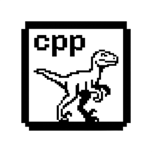

<p align="center"></p>

# dinov2.cpp

Run DINOv2 vision models in pure C++ on ggml. No Python, no PyTorch, no system dependencies at runtime.

[](https://github.com/espetro/dinov2.cpp/releases)
[](https://github.com/espetro/dinov2.cpp/actions/workflows/build.yml)
[](LICENSE)


**See the [GitHub releases page](https://github.com/espetro/dinov2.cpp/releases/latest) for the latest prebuilt binaries.**

**Release post & benchmarks → https://alexlavaee.me/projects/dinov2cpp/**

## Quick start

### Quickstart with agents

Using Claude Code, Cursor or another coding agent? Paste this:

```text
Install https://github.com/espetro/dinov2.cpp via mise (latest), download the small GGUF from the dinov2-cpp-core profile on Hugging Face, and run classification plus `--print-embeddings` on an example image to verify it works.
```

### Manual install

Grab a prebuilt binary, download a weight, run one command. No toolchain needed.

**1. Install a prebuilt binary** from [releases](https://github.com/espetro/dinov2.cpp/releases):

```bash
# Resolve the latest release tag (tarball names embed it)
TAG=$(basename "$(curl -sIL -o /dev/null -w '%{url_effective}' https://github.com/espetro/dinov2.cpp/releases/latest)")

# macOS (Apple Silicon)
curl -LO "https://github.com/espetro/dinov2.cpp/releases/download/$TAG/dinov2-$TAG-bin-macos-arm64.tar.gz"
tar xzf "dinov2-$TAG-bin-macos-arm64.tar.gz"

# Linux x64 / arm64: dinov2-$TAG-bin-ubuntu-x64.tar.gz / dinov2-$TAG-bin-ubuntu-arm64.tar.gz
# Windows (version-stable asset name):
#   https://github.com/espetro/dinov2.cpp/releases/latest/download/dinov2-bin-win-cpu-x64.zip
```

**2. Download a GGUF weight:**

```bash
hf download dinov2-cpp-core/dinov2-small-gguf --local-dir models
```

**3. Run inference** (`-c` for classification; add `-o out.png` for a PCA feature visualization):

```bash
./bin/dinov2-cli -m models/model.gguf -i assets/tench.jpg -c
```

**Embeddings (JSON)** for PyTorch `last_hidden_state[:, 0]` consumers:

```bash
./bin/dinov2-cli -m models/model.gguf -i assets/tench.jpg --print-embeddings
```

Emits `cls`/`pooled` vectors on stdout as one JSON object.

Feature mode bounds the input's shortest edge to 518 px by default
(`--preprocess bounded`) so attention memory stays predictable on large
images; `--preprocess hf` mirrors the HF `AutoImageProcessor` recipe
(256 shortest edge + 224 center crop) for like-for-like comparisons, and
`--preprocess crop518` fixes every input at 518x518 for batching mixed
aspect ratios. `--no-resize` keeps native resolution, and `--max-tokens N`
caps the patch-token count per image (default `4*(518/patch)^2`).

**Preview binary embeddings:** for high-throughput consumers, use
`--embeddings-binary -o output.d2e`. This deliberately unstable preview writes
an explicit 40-byte little-endian header followed by float32 `cls`, `pooled`,
and optional row-major patch vectors. It writes no binary bytes to stdout.
With multiple inputs, `-o` is a directory containing indexed `.d2e` files.
The format may change without compatibility guarantees and is not a standard.

**Batch inference:** repeat `-i` (or comma-separate paths) and set `--batch`;
each input gets one JSON line on stdout, identical to running it alone
(see [docs/cli.md](docs/cli.md#batch-inference)):

```bash
./bin/dinov2-cli -m models/model.gguf -i a.jpg -i b.jpg --batch 2 --print-embeddings
```

That's it. Up to **3x faster than PyTorch on CPU** with up to **4x less memory** (i9-14900HX, see [benchmarks methodology](docs/benchmarks.md)).

## C API

Embedding `dinov2.cpp` instead of shelling out? The build produces
`libdinov2` (static by default, shared with `-DBUILD_SHARED_LIBS=ON`) and a
pure C header at [`include/dinov2.h`](include/dinov2.h): opaque handles, no
ggml types, status codes instead of aborts. Models load from a file, a memory
buffer, or a read callback; `dino_encode` runs a batch of raw RGB8 images and
the `dino_output_*` accessors return borrowed pointers into the context.

```c
#include "dinov2.h"

dino_model *m = dino_model_load_from_file("models/model.gguf", dino_model_default_params());
dino_ctx   *c = dino_init_from_model(m, dino_ctx_default_params());

dino_image img = {pixels, w, h, 0}; // interleaved RGB8, stride 0 = packed
if (dino_encode(c, &img, 1, dino_run_default_params()) == DINO_STATUS_SUCCESS) {
    const float *cls = dino_output_cls(c, 0); // dino_model_hidden_size(m) floats
}
dino_free(c);
dino_model_free(m);
```

The API is unstable for the 0.4.x line; see [docs/stability.md](docs/stability.md).

## Tier-2 extras

Opt-in surfaces, off by default and not covered by the stability contract
([docs/tiers.md](docs/tiers.md)):

- **HTTP server**: `dinov2-server` is a single-binary embeddings
  microservice over the C API (`-DDINOV2_BUILD_SERVER=ON`). POST an image to
  `/v1/embeddings`, get `cls`/`pooled`/patch vectors back as JSON. See
  [tools/server/README.md](tools/server/README.md).
- **wasm**: the encoder compiles to WebAssembly and runs in the browser;
  see [docs/wasm.md](docs/wasm.md).
- **examples/**: `examples/dedup/` finds near-duplicate photos with the CLI
  (stdlib-only Python, writes an HTML review page);
  `examples/ci-visual-regression/` is a copy-paste GitHub Action that gates
  screenshots by embedding cosine.

## Features

| Feature | Detail |
|:--------|:-------|
| **Zero dependencies** | Image I/O via vendored stb, compute via ggml. Nothing else. |
| **CPU, CUDA, Metal** | Backends via ggml wherever ggml supports them. |
| **f16 GGUF weights** | Plus q4_0 through q8_0 quantization. |
| **PyTorch-parity outputs** | CLS + patch embeddings as JSON, matching the reference implementation. |
| **Cross-platform prebuilts** | macOS arm64, Linux x64/arm64, Windows x64. |

**Limitations:** image decode is vendored stb_image only (JPEG, PNG, BMP,
TGA; no HEIC, WebP, RAW, or AVIF, convert those first with `sips`,
`heif-convert`, or `ffmpeg`). Embeddings are image-to-image: this is not
CLIP and there are no text queries. Classification is ImageNet-1k only.

## Pre-converted GGUF weights

Ready-to-download f16 GGUF weights, published by CI to the [`dinov2-cpp-core`](https://huggingface.co/dinov2-cpp-core) Hugging Face profile:

| Model | GGUF download | Size | Recommendation |
|:-----:|:--------------|-----:|:---------------|
| small (no registers) | [`dinov2-cpp-core/dinov2-small-gguf`](https://huggingface.co/dinov2-cpp-core/dinov2-small-gguf) | ~50 MB | Baseline reproduction or task comparison |
| base (no registers) | [`dinov2-cpp-core/dinov2-base-gguf`](https://huggingface.co/dinov2-cpp-core/dinov2-base-gguf) | ~180 MB | Baseline reproduction or task comparison |
| large (no registers) | [`dinov2-cpp-core/dinov2-large-gguf`](https://huggingface.co/dinov2-cpp-core/dinov2-large-gguf) | ~620 MB | Baseline reproduction or task comparison |
| giant (no registers) | [`dinov2-cpp-core/dinov2-giant-gguf`](https://huggingface.co/dinov2-cpp-core/dinov2-giant-gguf) | ~2.2 GB | Baseline reproduction or task comparison |
| small (registers) | [`dinov2-cpp-core/dinov2-with-registers-small-gguf`](https://huggingface.co/dinov2-cpp-core/dinov2-with-registers-small-gguf) | ~50 MB | **Recommended for patch/dense features** |
| base (registers) | [`dinov2-cpp-core/dinov2-with-registers-base-gguf`](https://huggingface.co/dinov2-cpp-core/dinov2-with-registers-base-gguf) | ~180 MB | **Recommended for patch/dense features** |
| large (registers) | [`dinov2-cpp-core/dinov2-with-registers-large-gguf`](https://huggingface.co/dinov2-cpp-core/dinov2-with-registers-large-gguf) | ~620 MB | **Recommended for patch/dense features** |
| giant (registers) | [`dinov2-cpp-core/dinov2-with-registers-giant-gguf`](https://huggingface.co/dinov2-cpp-core/dinov2-with-registers-giant-gguf) | ~2.2 GB | **Recommended for patch/dense features** |

For patch and dense feature workflows, the register-token variants are the recommended starting point. In the settings studied in [Vision Transformers Need Registers](https://arxiv.org/abs/2309.16588), register tokens reduce high-norm patch-token artifacts and produce smoother local feature and attention maps. Use them with `--print-patch-tokens`, PCA, dense features, and object discovery. This is not a universal accuracy claim: the official [DINOv2 results](https://github.com/facebookresearch/dinov2/blob/main/README.md) show classification and retrieval results that depend on the task and model size. Choose the no-register variant for exact baseline reproduction or task-specific classification and retrieval comparisons.

## Documentation

- [CONTRIBUTING.md](CONTRIBUTING.md): pre-converted GGUF weights, build from source, dev harness, tests, PR guidelines
- [docs/cli.md](docs/cli.md): `dinov2-cli` reference: flags, output modes, embeddings JSON schema, workflows
- [docs/build.md](docs/build.md): per-device optimizations, quantization
- [docs/benchmarks.md](docs/benchmarks.md): benchmarks against PyTorch, how to run your own
- [docs/hf-publishing.md](docs/hf-publishing.md): how CI publishes GGUF weights to Hugging Face
- [docs/wasm.md](docs/wasm.md): Emscripten/WebAssembly build and browser demo
- [docs/stability.md](docs/stability.md) + [docs/tiers.md](docs/tiers.md): the compatibility contract and tier policy

## Why this fork

Upstream requires building from source and converting weights yourself. This fork ships what's missing: prebuilt binaries for macOS, Linux and Windows, plus ready-to-download GGUF weights published automatically by CI.

## Credits

Forked from [lavaman131/dinov2.cpp](https://github.com/lavaman131/dinov2.cpp). Built on and heavily inspired by [vit.cpp](https://github.com/staghado/vit.cpp) and [ggml](https://github.com/ggml-org/ggml).

## License

[MIT](LICENSE)
