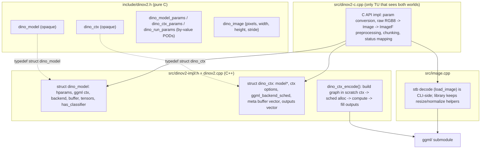

# Library extraction and C API design

Status: proposed design only. This document does not claim that any implementation described below has landed.

Date: 2026-09-22

## 1. Summary

`dinov2.cpp` today is a single translation-unit set: `dinov2.cpp` mixes the encoder engine
(graph build, model load, inference) with CLI-only helpers (argv parsing, usage text,
binary embeddings writer), and `dinov2-cli` compiles the sources directly. There is no
library target and no API an external program could bind to.

This design restructures the repo into three layers:

1. `libdinov2`: a proper CMake library target (`add_library`, `BUILD_SHARED_LIBS`-aware)
   containing the engine (`dinov2.cpp`), image preprocessing (`src/image.cpp`), and a
   pure C API (`src/dinov2-c.cpp`, public header `include/dinov2.h`).
2. `dinov2-cli`: unchanged command-line contract, now linked against `libdinov2` and
   owning all CLI-only code (params parsing, usage, JSON/PCA/binary output helpers,
   bench loop).
3. Tests link the library instead of recompiling sources; a new `test_dinov2_c`
   exercises the C API end to end on synthetic GGUF fixtures.

Internally the code adopts the llama.cpp object split: an opaque `dino_model` (weights +
hparams + backend) and an opaque `dino_ctx` (scheduler, scratch memory, last-run outputs).
Graph compute moves from caller-managed `ggml_gallocr` to a `ggml_backend_sched` owned by
the context, and backend selection moves from compile-time `GGML_USE_CUDA`/`GGML_USE_METAL`
ifdefs to the runtime backend registry (`ggml_backend_load_all`, `ggml_backend_init_best`,
device selection by name).

## 2. Goals

- A pure C, self-contained public header `include/dinov2.h`: compilable with
  `gcc -std=c11`, no ggml/gguf types leaked, opaque handles only.
- Load triad: file, buffer (`gguf_init_from_buffer`, present in vendored ggml v0.24.0),
  and reader callback (`gguf_init_from_callback`) so callers can mmap/stream weights.
- Batch inference from day 1: `dino_encode` takes N images per call.
- Compute-then-accessors: `dino_encode` writes outputs into the context; getters return
  borrowed `const float *` valid until the next `dino_encode`.
- The context owns the compute scheduler (`ggml_backend_sched` plus the scratch cgraph
  arena, whisper's `whisper_sched` shape). `ggml_gallocr` and all allocr plumbing die.
- Registry-based backend init: lazy `ggml_backend_load_all()` inside model load,
  `ggml_backend_init_best()` or a named device, no backend ifdefs in our sources.
- CLI contract is byte-identical: same flags, JSON keys/order, exit codes, and stderr
  messages. Verified by diffing against a baseline binary built from the pre-refactor
  commit.

## 3. Non-goals

- No thread-safety guarantees beyond "distinct contexts are independent"; a `dino_ctx`
  is single-threaded per `dino_encode` call.
- No GPU buffer lifetime guarantees for output accessors: getters copy into host
  `std::vector<float>` storage owned by the context.
- No streaming/chunked attention; `--max-tokens`-equivalent caps still apply.
- No stability promise beyond what `docs/stability.md` will list: the C API is new and
  flagged unstable for the 0.4.x line.
- No ImageF/pixel-buffer types, no hparams struct, no ggml types in the public header.

## 4. Object model



Dependency direction is one-way: `dinov2.cpp`, `src/image.cpp`, and `src/dinov2-impl.h`
never include `include/dinov2.h` or anything under `bindings/`. Only `src/dinov2-c.cpp`
includes both headers and converts between the public PODs and the internal options
structs.

### Internal types (src/dinov2-impl.h)

```cpp
struct dino_model_options {           // model-load settings
    std::string device;               // "" = auto (ggml_backend_init_best); else ggml device name
    bool        require_classifier = false; // fail load when the GGUF has no classifier head
};

struct dino_ctx_options {             // context capacity + feature preprocessing recipe
    uint32_t n_threads         = std::min(4u, std::thread::hardware_concurrency());
    uint32_t n_batch           = 1;   // max images packed into one graph
    bool     enable_flash_attn = false;
    dino_preprocess_mode preprocess_mode = dino_preprocess_mode::bounded;
    bool     no_resize         = false;
    int64_t  max_tokens        = -1;  // -1: default cap; 0: disabled
};

struct dino_run_options {             // per-encode settings
    bool     classify      = false;   // run the classifier head; implies the 224x224 recipe
    uint32_t topk          = 5;
    bool     l2_normalize  = false;
};

struct dino_ctx {
    const dino_model *                model  = nullptr;   // borrowed; must outlive ctx
    dino_ctx_options                  options;
    ggml_backend_sched_t              sched  = nullptr;   // owns the graph allocator
    std::vector<ggml_backend_buffer_t> meta;              // arena hosting the scratch cgraph ctx
    size_t                            graph_size = 0;     // cgraph capacity, from layer count
    std::vector<dino_output>          outputs;            // last encode, input order
};
```

`dino_ctx::meta` follows whisper's `whisper_sched` shape: one host buffer per ctx
(currently a single CPU-buffer-type allocation) that acts as the arena for the
per-encode scratch `ggml_context` (`ggml_init` with `mem_buffer`, so the cgraph
metadata lives in a fixed allocation reused every call instead of a malloc per call).

The scheduler lifecycle per encode:

```text
ggml_backend_sched_reset(sched)          // clears is_alloc from the previous run
ctx_cgraph = ggml_init(meta arena)       // scratch context, no_alloc
gf = build_graph(img_size, ctx_cgraph)   // existing graph builder, unchanged
ggml_backend_sched_alloc_graph(sched, gf)
ggml_backend_tensor_set(input)           // write pixels + pos-embed table
ggml_backend_sched_graph_compute(sched, gf)
ggml_backend_tensor_get(outputs)         // cls / patch_tokens / probs
ggml_free(ctx_cgraph)                    // returns arena, not the meta buffer
```

### Why dino_ctx instead of a stateless dino_predict

`dino_predict(model, imgs, params, allocr)` forced every caller to manage the graph
allocator and returned fresh output vectors per call. Owning the scheduler and the
output storage in `dino_ctx` is what makes the C accessors possible: the C API returns
borrowed pointers into `ctx.outputs`, documented as invalidated by the next encode.

## 5. Backend selection and threading

Compile-time backend selection is deleted entirely:

- `#ifdef GGML_USE_CUDA / GGML_USE_METAL` blocks and the `ggml-cuda.h`/`ggml-metal.h`
  includes are removed from `dinov2.cpp`.
- Model load ensures the registry is populated exactly once
  (`ggml_backend_load_all()` behind a `std::once_flag`; a `ggml_backend_reg_count()==0`
  guard cannot work here because merely touching the registry lazily registers the
  built-in CPU backend, so the count is never 0 when observed).
- Device selection: `dino_model_options.device` empty -> `ggml_backend_init_best()`
  (GPU if present, else CPU); non-empty -> `ggml_backend_init_by_name(device)` with a
  clean error on failure.
- `dino_backend_init()` is exported for callers that want explicit up-front loading.
- `n_threads` is applied at `dino_ctx_init` via the whisper idiom:
  `ggml_backend_dev_backend_reg(ggml_backend_get_device(backend))` then
  `ggml_backend_reg_get_proc_address(reg, "ggml_backend_set_n_threads")`, so it works on
  any backend that exports the entry point and silently no-ops elsewhere.
- The stderr line "using Metal backend" is preserved by printing
  `ggml_backend_name(model.backend)`; on CPU-only builds the line becomes
  "using CPU backend" (a deliberate, harmless addition).

## 6. Model load triad

`dino_model_load` is split into a small front section (backend init + gguf source) and a
shared tail (`hparams` validation, tensor requirements, weight upload). Three entry
points feed the tail:

- `dino_model_load_file(path, model, options)`: `gguf_init_from_file` (unchanged path).
- `dino_model_load_buffer(data, size, model, options)`: `gguf_init_from_buffer`.
- `dino_model_load_callback(read, userdata, model, options)`: `gguf_init_from_callback`
  with `max_chunk_read = 0` (no limit) and `max_expected_size = UINT64_MAX`.

Classifier handling: `require_classifier` (model option) keeps today's load-time
preflight messages for the CLI. Independently, when classifier tensors and a non-zero
`num_classes` are present, labels are read opportunistically (missing labels tolerated)
so `dino_model_label` works without `require_classifier`; when `require_classifier` is
set, the label table must be complete, matching current behavior byte for byte.

## 7. The C API (include/dinov2.h, full proposed listing)

```c
#ifndef DINOV2_H
#define DINOV2_H

#include <stdbool.h>
#include <stddef.h>
#include <stdint.h>

#ifdef DINOV2_SHARED
#    ifdef _WIN32
#        ifdef DINOV2_BUILD
#            define DINO_API __declspec(dllexport)
#        else
#            define DINO_API __declspec(dllimport)
#        endif
#    else
#        define DINO_API __attribute__((visibility("default")))
#    endif
#else
#    define DINO_API
#endif

#ifdef __GNUC__
#    define DINO_DEPRECATED(func, hint) func __attribute__((deprecated(hint)))
#elif defined(_MSC_VER)
#    define DINO_DEPRECATED(func, hint) __declspec(deprecated(hint)) func
#else
#    define DINO_DEPRECATED(func, hint) func
#endif

#ifdef __cplusplus
extern "C" {
#endif

#define DINO_MAX_BATCH 64

// opaque handles; the C++ definitions live in src/dinov2-impl.h
typedef struct dino_model dino_model;
typedef struct dino_ctx   dino_ctx;

typedef enum dino_status {
    DINO_STATUS_SUCCESS          = 0,
    DINO_STATUS_ERROR            = 1, // unspecified internal failure
    DINO_STATUS_INVALID_ARGUMENT = 2, // null pointers, bad dims/stride, n_images out of range, topk == 0 or > n_classes
    DINO_STATUS_ALLOC_FAILED     = 3, // compute graph buffer allocation failed
    DINO_STATUS_COMPUTE_FAILED   = 4, // backend graph compute failed
    DINO_STATUS_NO_CLASSIFIER    = 5, // classify requested on a backbone-only model
    DINO_STATUS_TOO_MANY_TOKENS  = 6, // an image exceeded the ctx max_tokens cap
} dino_status;

typedef enum dino_preprocess {
    DINO_PREPROCESS_BOUNDED = 0, // shortest edge <= 518, patch-aligned (CLI default)
    DINO_PREPROCESS_HF      = 1, // HF recipe: shortest edge 256 + center crop 224
    DINO_PREPROCESS_CROP518 = 2, // fixed 518x518 grid
} dino_preprocess;

// streaming read callback for dino_model_load_from_callback:
// read up to `len` bytes at `offset` into `output`, return bytes read
typedef size_t (*dino_reader_callback_t)(void * userdata, void * output, uint64_t offset, size_t len);

typedef struct dino_model_params {
    const char * device;             // NULL = auto-select; else a ggml device name ("Metal", "CUDA0", "CPU", ...)
    bool         require_classifier; // fail load unless the GGUF carries a classifier head + labels
} dino_model_params;

typedef struct dino_ctx_params {
    int32_t           n_threads;    // applied via ggml_backend_set_n_threads proc address
    int32_t           n_batch;      // max images packed into one forward pass (1..DINO_MAX_BATCH)
    bool              flash_attn;
    dino_preprocess   preprocess;   // feature-mode recipe; classify ignores it
    bool              no_resize;    // bounded mode only: keep native resolution
    int64_t           max_tokens;   // -1: default cap (4 * (518/patch)^2); 0: disabled
} dino_ctx_params;

typedef struct dino_run_params {
    bool    classify;      // run the classifier head and fill topk outputs
    int32_t topk;          // number of top classes stored per image when classify is set
    bool    l2_normalize;  // L2-normalize cls/pooled/patch vectors before storing
} dino_run_params;

// one image of a batch: interleaved RGB8, row-major
typedef struct dino_image {
    const uint8_t * pixels;  // required
    int32_t         width;   // > 0
    int32_t         height;  // > 0
    int32_t         stride;  // bytes per row; 0 means tightly packed (width * 3)
} dino_image;

DINO_API const char * dino_version(void);

// Load every available backend into the ggml registry. Optional: model load
// calls this lazily on first use. Safe to call more than once.
DINO_API void dino_backend_init(void);

DINO_API struct dino_model_params dino_model_default_params(void);
DINO_API struct dino_ctx_params   dino_ctx_default_params(void);
DINO_API struct dino_run_params   dino_run_default_params(void);

// Load a GGUF model. Returns NULL on failure (details on stderr).
DINO_API dino_model * dino_model_load_from_file    (const char * path, struct dino_model_params params);
DINO_API dino_model * dino_model_load_from_buffer  (const void * data, size_t size, struct dino_model_params params);
DINO_API dino_model * dino_model_load_from_callback(dino_reader_callback_t read, void * userdata,
                                                    struct dino_model_params params);
DINO_API void         dino_model_free(dino_model * model);

// Model metadata; 0/NULL when absent. label() returns NULL for classes without a label.
DINO_API uint32_t     dino_model_hidden_size      (const dino_model * model);
DINO_API uint32_t     dino_model_patch_size       (const dino_model * model);
DINO_API uint32_t     dino_model_n_register_tokens(const dino_model * model);
DINO_API bool         dino_model_has_classifier   (const dino_model * model);
DINO_API uint32_t     dino_model_n_classes        (const dino_model * model);
DINO_API const char * dino_model_label            (const dino_model * model, uint32_t class_index);

// Create an inference context on a model. The model is borrowed and must
// outlive the context. Returns NULL on invalid params.
DINO_API dino_ctx * dino_init_from_model(dino_model * model, struct dino_ctx_params params);
DINO_API void       dino_free(dino_ctx * ctx);

// Run a batch of raw RGB8 images through the encoder. All preprocessing
// (resize, crop, ImageNet normalization) happens inside the library.
// n_images must be 1..DINO_MAX_BATCH. Feature mode groups consecutive
// same-sized images into chunks of up to ctx n_batch; classify mode always
// produces 224x224 inputs, so the whole call is one chunk when n_batch allows.
// Results are stored in the ctx; use the dino_output_* accessors.
DINO_API enum dino_status dino_encode(dino_ctx * ctx, const struct dino_image * images,
                                      int32_t n_images, struct dino_run_params params);

// Output accessors. Returned pointers are borrowed, point into storage owned by
// ctx, and are invalidated by the next dino_encode or by dino_free.
DINO_API int32_t       dino_output_n_images(const dino_ctx * ctx);
// cls embedding: hidden_size floats per image
DINO_API const float * dino_output_cls   (const dino_ctx * ctx, int32_t index);
// pooled embedding [cls || mean(patches)]: 2 * hidden_size floats; NULL in classify mode
DINO_API const float * dino_output_pooled(const dino_ctx * ctx, int32_t index);
// patch tokens: grid_w * grid_h * hidden_size floats, row-major; NULL in classify mode.
// All out params may be NULL.
DINO_API const float * dino_output_patches(const dino_ctx * ctx, int32_t index,
                                           int32_t * n_patches, int32_t * grid_w, int32_t * grid_h);
// classify mode: writes the top-k index/probability arrays, returns k. 0/NULL otherwise.
DINO_API int32_t       dino_output_topk(const dino_ctx * ctx, int32_t index,
                                        const uint32_t ** indices, const float ** probs);

#ifdef __cplusplus
}
#endif

#endif // DINOV2_H
```

### Batch signature choice: struct array, not parallel arrays

`llama_batch` uses parallel arrays (`token`, `pos`, `seq_id`, ...) because it models
jagged per-token/per-sequence data where some fields are optional per element. A DINOv2
image record is fixed-shape (pointer + three scalars), so an array of small structs is
the cleaner C idiom: one `const dino_image *` parameter cannot desynchronize the way
four parallel arrays can, it extends without signature churn, and it matches how
imaging APIs (stb, Vulkan-style descriptors) pass records. The spec adopts
`dino_encode(ctx, images[], n_images, run_params)`.

## 8. Internal header placement: src/dinov2-impl.h

Two files named `dinov2.h` (public `include/dinov2.h` and an internal root header) would
collide on quoted-include resolution and confuse include-path order. The internal
header moves to `src/dinov2-impl.h`, alongside `src/image.h`. `dinov2.cpp` stays at the
repo root (minimal churn); `dinov2-cli.cpp`, `src/dinov2-c.cpp`, and the tests include
`src/dinov2-impl.h`. External consumers only ever see `include/dinov2.h`, installed by
the library target.

## 9. dino_params split

The old `dino_params` god-object splits into:

- `dino_model_options` (internal): device, require_classifier.
- `dino_ctx_options` (internal): n_threads, n_batch, enable_flash_attn,
  preprocess_mode, no_resize, max_tokens.
- `dino_run_options` (internal): classify, topk, l2_normalize.
- `dino_cli_params` (in `dinov2-cli.cpp` only): seed, model path, input paths, -o,
  print_embeddings / embeddings_binary / print_patch_tokens, bench controls, plus the
  three options structs embedded above.
- Public PODs `dino_model_params` / `dino_ctx_params` / `dino_run_params` in
  `include/dinov2.h`; `src/dinov2-c.cpp` converts them to the internal options. The
  internal structs keep different names on purpose so the wrapper TU can see both sets.

Moving `classify` to a run option lets one context serve both feature and classify
encodes; the CLI still fixes it at parse time and also sets `require_classifier` so the
load-time preflight message is unchanged.

## 10. CMake scheme

```cmake
option(DINOV2_BUILD_CLI   "Build the dinov2-cli executable"        ON)
option(DINOV2_BUILD_C_API "Build the C API (include/dinov2.h)"     ON)
option(DINOV2_BUILD_TESTS "Build doctest unit tests"               ON)   # unchanged
option(DINOV2_FATAL_WARNINGS "..." OFF)                                   # unchanged

add_library(dinov2 dinov2.cpp src/image.cpp)          # honors BUILD_SHARED_LIBS
# + src/dinov2-c.cpp when DINOV2_BUILD_C_API
target_link_libraries(dinov2 PUBLIC ggml)
target_include_directories(dinov2 PUBLIC include .)   # include/ is the installed API
# WINDOWS_EXPORT_ALL_SYMBOLS so the CLI/tests can reach internal symbols in shared builds
# PRIVATE defines: DINOV2_BUILD + DINOV2_SHARED when BUILD_SHARED_LIBS

add_executable(dinov2-cli dinov2-cli.cpp)             # links dinov2
```

## 11. Commit ordering

Each commit must configure, build, and pass `ctest` on the debug preset:

1. `docs(spec):` this document.
2. `refactor: split CLI-only code into dinov2-cli.cpp`: move `dino_params_parse`,
   `print_usage`, `write_embeddings_binary`, CSV/numeric parsing; split `dino_params`
   into model/ctx/run options + `dino_cli_params`; move parse unit tests to black-box
   cases in `test_cli.cpp`. No behavior change.
3. `refactor: introduce dino_ctx owning the graph allocator and last-run outputs`:
   `dino_ctx_init`/`dino_ctx_free`/`dino_ctx_encode`; `dino_predict` dies; the allocr is
   created inside the ctx (still a `ggml_gallocr` at this stage).
4. `build: add_library(dinov2)`: CLI + tests link the library; `DINOV2_BUILD_CLI`
   option; `WINDOWS_EXPORT_ALL_SYMBOLS`; internal header moves to `src/dinov2-impl.h`.
5. `refactor: registry backend init + ggml_backend_sched`: delete backend ifdefs, lazy
   `ggml_backend_load_all`, `ggml_backend_init_best`/by-name, sched + meta buffer in
   ctx, `n_threads` via proc address, allocr plumbing deleted from the CLI.
6. `feat: load models from buffer and callback readers`.
7. `feat: public C API` (`include/dinov2.h` + `src/dinov2-c.cpp`, `DINOV2_BUILD_C_API`,
   export macros, shared-lib defines).
8. `test: C API coverage` (`tests/test_dinov2_c.cpp`, doctest, synthetic GGUF fixture,
   batch encode, C++-path comparison, classify/topk, buffer/callback loads, error
   paths).
9. `docs: architecture, README C API section, stability stub`.

## 12. Test plan

Per stage: `cmake --preset debug`, `cmake --build --preset debug`,
`ctest --test-dir build-debug --output-on-failure`.

Final gate:

- `asan` and `ubsan` presets: 4/4 ctest entries pass (new `test_dinov2_c` adds one).
- `test_dinov2_c` covers: GGUF fixture written in-process (TinyModel-equivalent:
  hidden 16, patch 2, img 8, 2 layers, classifier, 7 classes), batch of 2 raw RGB8
  images through `dino_encode`, cls vector equality vs the C++ path on the same file,
  classify + `dino_output_topk`, `dino_model_load_from_buffer` and `_from_callback`
  equivalence, accessor invalidation semantics, and error statuses (NULL model/ctx,
  bad dims, bad stride, n_images 0 and > DINO_MAX_BATCH, classify on a backbone-only
  GGUF, topk > n_classes).
- CLI parity: `diff` stdout/stderr/exit codes of the new binary vs a baseline binary
  built from the pre-refactor commit on: tench classify, tench `--print-embeddings`,
  two-image `--batch 2`, `-fa`, `--preprocess hf`, `--embeddings-binary` (byte-compared
  `.d2e`), `--bench --bench-json`, and the big.png `--max-tokens` cap error.
- `tests/test_dinov2_converter.py` still passes (converter fixtures unchanged).
- `DINOV2_FATAL_WARNINGS` build clean; `clang-format-18` on all touched C/C++;
  `git diff --check`.
- A `gcc -std=c11` smoke program under /tmp including only `include/dinov2.h` and
  linking the built library proves the header is real C and self-contained.

## 13. What stays unchanged

- The GGUF schema, metadata keys, and tensor names written by
  `scripts/dinov2-to-gguf.py`; published HF models keep working unchanged.
- All preprocessing recipes: bounded 518 shortest-edge + true-ceil patch alignment,
  hf (256 + 224 crop), crop518, and the classify recipe; pixel values are bit-identical.
- The encoder graph structure (attn/mlp/swiglu/pads/casts), so logits are identical
  modulo backend nondeterminism.
- The JSONL/JSON schemas and key order, the human-readable top-k format, exit codes,
  and stderr message texts.
- The D2EMB preview binary format (still explicitly unstable).
- `dino_hparams`, `dino_output`, `ImageF`, `interpolate_pos_embed`, the preprocessing
  helpers, and `DINO_MAX_BATCH` semantics (it becomes the public encode cap too).
- `docs/cli.md` content: the CLI contract is untouched.
