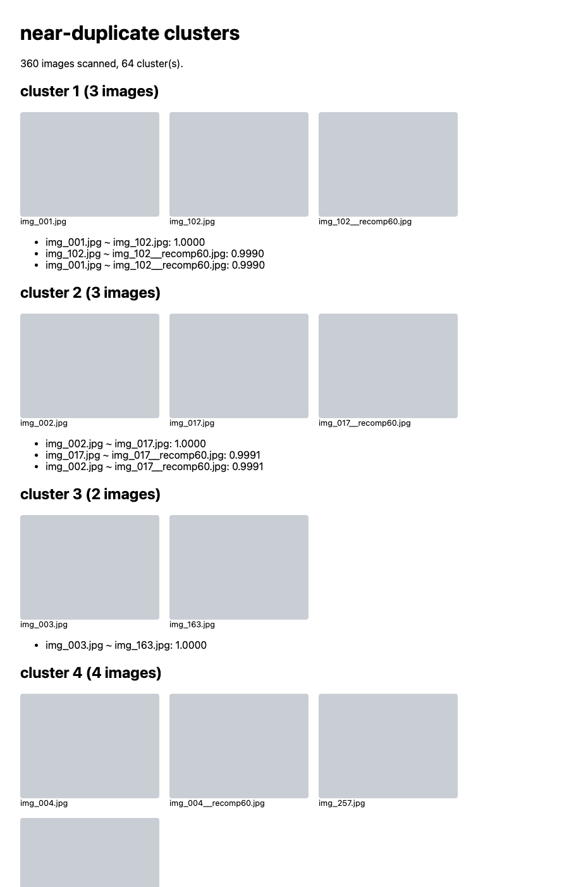

# dedup: near-duplicate photo finder

Dedup a folder of images locally, no cloud. `dedup.py` shells out to
`dinov2-cli --print-embeddings`, compares the `pooled` vectors pairwise with
cosine similarity, clusters near-duplicates (single-linkage union-find), and
writes a small HTML page so you can eyeball the groups before deleting
anything.

Tier-2 example: Python stdlib only, no dependencies, not part of the shipped
binary or CI gates.

## Usage

```bash
python3 dedup.py <dinov2-cli> <model.gguf> <image_dir> [-t 0.95] [-o report.html]
```

```bash
# build the CLI and grab a weight first (see README.md quickstart)
python3 examples/dedup/dedup.py \
  ./build-release/bin/dinov2-cli models/model.gguf ~/Photos/dump \
  -t 0.95 -o dupes.html
open dupes.html
```

- `-t/--threshold`: cosine cutoff for "near duplicate". `0.99` catches
  re-encodes and resizes; `0.95` catches same-scene shots; lower starts
  grouping merely similar images. Tune on a small folder first.
- `-o/--out`: where the HTML review page goes (default `dedup-report.html`).

The script uses `pooled` (`[cls || mean(patches)]`) when present and falls
back to `cls`. For large folders the pairwise pass is O(n^2) in Python; a
few thousand images is fine, hundreds of thousands will want a real index
(FAISS, sqlite-vec, ...).

Caveat: `.webp` is listed in `EXTS` but `dinov2-cli` cannot decode WebP
(`stb_image` has no WebP support). A single `.webp` file in the scanned
folder makes the CLI exit non-zero and the script aborts. Keep the input
folder to JPEG/PNG/BMP/TGA until that is fixed.

## Measured run (synthetic corpus, planted duplicates)

Corpus: 320 photos from `picsum.photos` (`/seed/<n>/400/300`, seeds 1..320,
all JPEG) plus 40 planted variants of 30 of them (every source got a JPEG
recompress at q=60; 10 sources also got an 80% resize, a 90% center crop,
or a +15% brightness shift). Picsum maps seeds onto a limited photo pool,
so the download itself already contained natural duplicates; ground truth
was therefore built from pixel-identical groups of the originals (46 groups
covering 98 files) plus the planted variants, giving 64 true duplicate
clusters and 130 true duplicate pairs across 360 files.

Command (Apple M1, Metal, `dinov2-small`):

```bash
/usr/bin/time -l python3 examples/dedup/dedup.py \
  ./build-release/bin/dinov2-cli models/dinov2-small/model.gguf \
  /tmp/dedup-corpus/images -o report.html
```

Result: 360 images embedded in 124 s wall clock (~0.35 s/image), peak RSS
~335 MB, 64 clusters reported at the default `-t 0.95`.

Scored pair-level against ground truth (predicted pairs are all pairs
inside reported clusters):

| threshold | clusters | precision | recall | F1    |
|-----------|----------|-----------|--------|-------|
| 0.999     | 60       | 1.000     | 0.646  | 0.785 |
| 0.99      | 64       | 1.000     | 0.846  | 0.917 |
| 0.975     | 64       | 1.000     | 0.915  | 0.956 |
| 0.95      | 64       | 1.000     | 0.977  | 0.988 |
| 0.90      | 63       | 0.935     | 1.000  | 0.967 |
| 0.85      | 63       | 0.867     | 1.000  | 0.929 |

On this corpus the default `0.95` is the sweet spot: zero false merges,
and the only miss is one 90% center crop that lands at ~0.93 similarity.
Raising the cutoff toward `0.99` keeps precision perfect but drops recall
to 0.85 (crops and some resizes fall under the bar); lowering it to `0.90`
reaches perfect recall at the cost of 9 false pairs from merely similar
photos.


